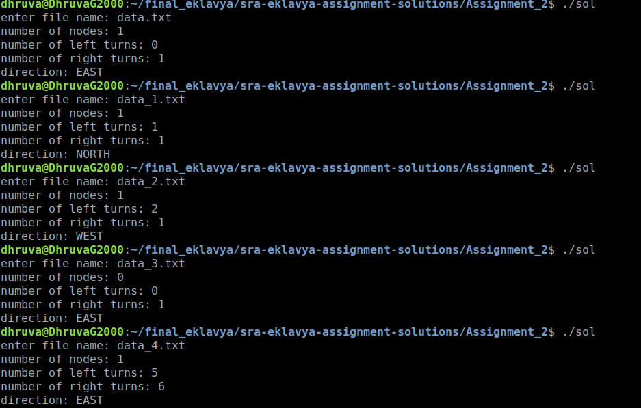

# Solution for Task 2
From the given dataset we are expected to count the number of nodes, number of turns
and the direction bot faces at the end. 

__The file handling part is same, hence refer previous Task if you have any doubts in that area__

## Algorithm used:

```
function line_sensor_interpret() returns:
*  2 if its a node
*  1 if right turn
* -1 if left turn
*  0 if bot is just moving straight

we check which value we get from the above function and:
if line_sensor readings toggle from 0 to 1:
	turn_has_started

if turn_has_started AND prev_line_sensor == 1 AND current_line_sensor == 0 
	increase_right_turn_count

else if  turn_has_started AND prev_line_sensor == -1 AND current_line_sensor == 0 
	increase_left_turn_count

else if (node_conditions)
	increase_node_count 
```

## Finally print the answers:

```
printf("number of nodes: %d\n", nodes);
printf("number of left turns: %d\n", left_turns);
printf("number of right turns: %d\n", right_turns);
printf("direction: %s\n", direction[1+(left_turns-right_turns)%4]);
```

Finding number of nodes, left turns, right turns and final facing direction of a line following robot.  
Detailed problem statement can be found [here](https://sra-vjti.github.io/eklavya2020-assignments/assignment_2.html).

```
gcc solution_2.c  
./a.out  
```
    
**Output**  



## Code:

```c

```