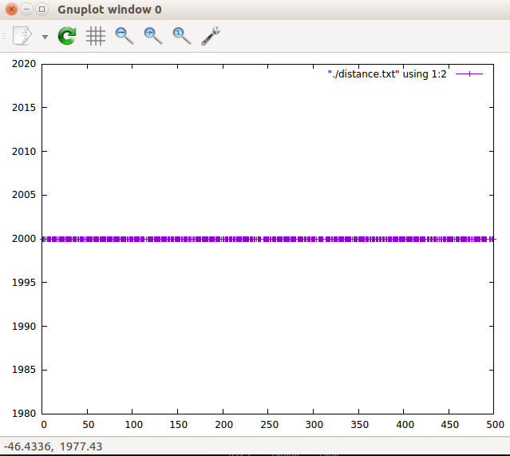
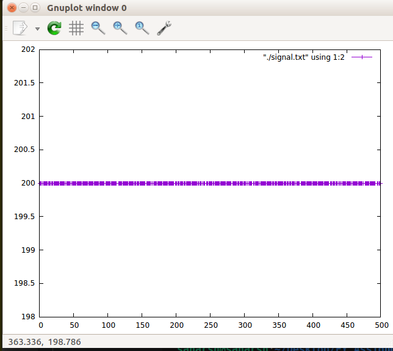
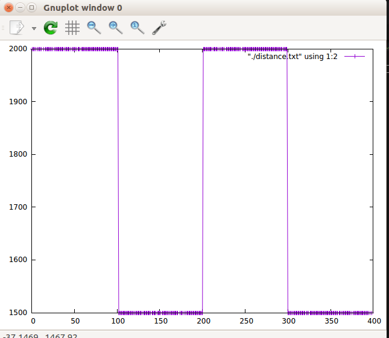
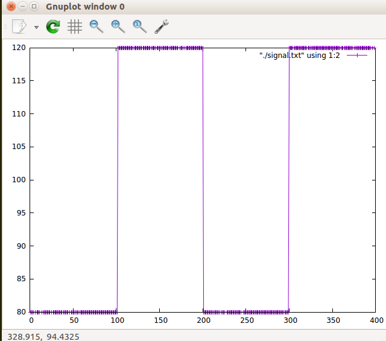

# Solution for Task 3

We are given 2 datasets having readings from a LIDAR, that are of distance and signal.

## Open the Binary file:
On Linux, and Unix in general, "r" and "rb" are the same. More specifically, a FILE pointer obtained by fopen()ing a file in in text mode and in binary mode behaves the same way on Unixes. On windows, and in general, on systems that use more than one character to represent "newlines", a file opened in text mode behaves as if all those characters are just one character, '\n'.

```
printf("Enter the file name: ");
  scanf("%s",filename);
	
  f = fopen(filename, "r");            	 //Input file
```

## Algorithm: 

```
we run the while loop till end of file.
using
fread(c, sizeof(unsigned char), 10, f);	
we read the contents of the binary file and store them in 
unsigned char c[10];

Next we make sure if the basic requirement
that first 2 bytes and last byte is as it should be according to the
given datasheet

then we verify the checksum

In checksum we are adding the all first 8 bytes together and we only consider the lower byte of the result.
Let's take one example:
Addition of first 8 Bytes = 59 + 59 + d0 + 07 + 50 + 00 + 69 + c8 = 030A
(03 - higher byte and 0A - lower byte)
So the checksum is 0A, the reason we have used unsigned char for checksum is if you added 8 bytes
then only the lower byte is stored in the checksum as the size of unsigned char is 1 byte.

Comments have been provided in the code for understanding how to calculate distance and signal
as integer values
we write the newly obtained values to files:
distance.txt and signal.txt 
```

## Instructions for plotting the results have already been given [here](https://sra-vjti.github.io/eklavya2020-assignments/assignment_3.html). 

```
gcc solution_3.c  
./a.out  

gnuplot  
gnuplot> plot "./distance.txt" using 1:2 with linespoints  
gnuplot> plot "./signal.txt " using 1:2 with linespoints  
```

**Output**  

```
Enter the filename: data.bin
Reading, Distance, Strength
1, 2000, 200
2, 2000, 200  
...  

Enter the filename: data_1.bin
Reading, Distance, Strength
1, 2000, 80
2, 2000, 80  
...  
102, 1500, 120
103, 1500, 120  
```

## Output Plots
**data.bin**   
  
  


**data_1.bin**  
  
  



## Code:

```c

```